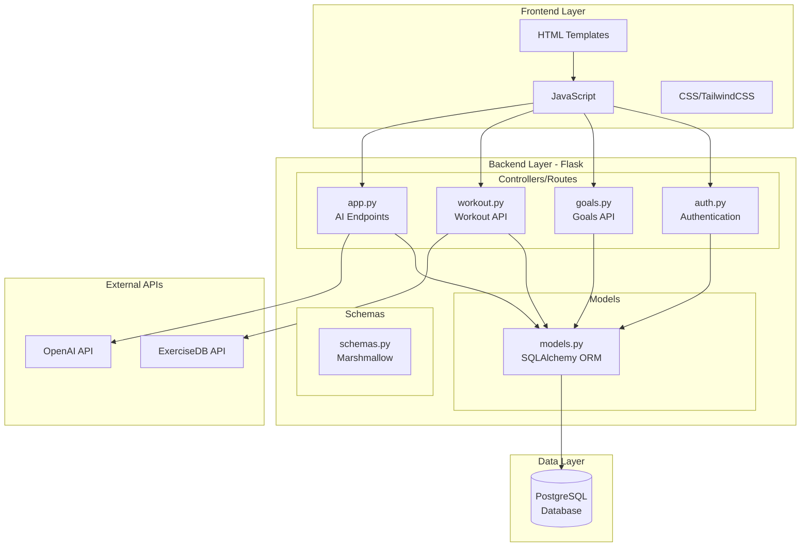
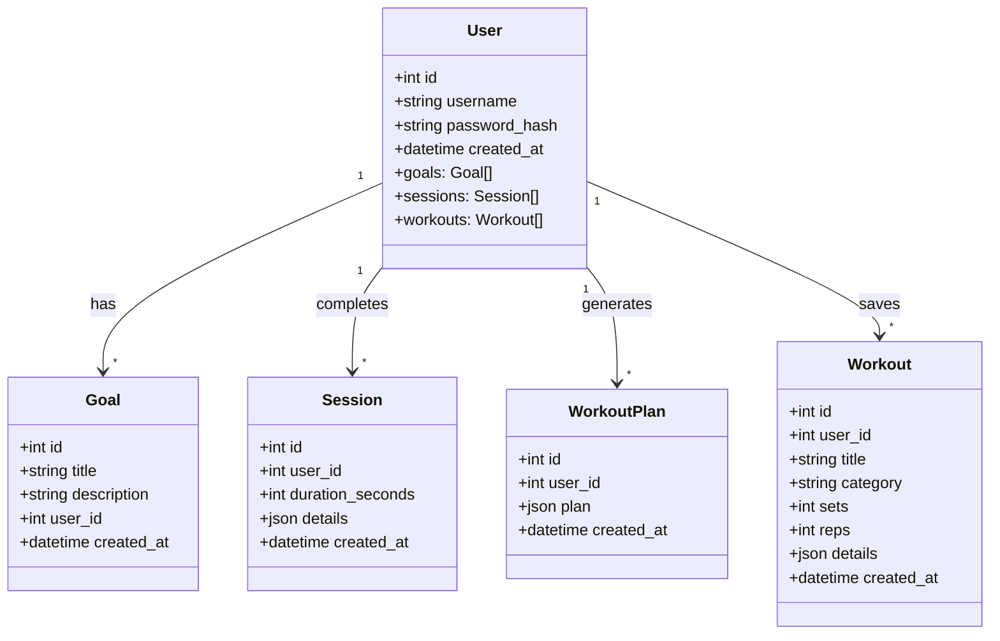

# Architecture Documentation

## Overview

CoreSync is a **Flask-based web application** following the **MVC (Model-View-Controller)** architectural pattern with RESTful API design.

---

## Package Diagram

---

## Class Diagram

---

## Component Responsibilities

### Frontend (templates/, static/)
- **HTML Templates**: Jinja2 templates for page rendering
- **JavaScript**: Client-side logic, API calls, localStorage management
- **CSS**: TailwindCSS styling with dark mode support

### Backend (Flask Blueprints)
- **auth.py**: User registration, login, JWT token management
- **goals.py**: CRUD operations for user goals
- **workout.py**: Exercise search, workout management, session tracking
- **app.py**: Main app, AI workout generation endpoints

### Data Layer
- **models.py**: SQLAlchemy ORM models
- **schemas.py**: Marshmallow serialization schemas
- **PostgreSQL**: Production database (SQLite for development)

### External Integrations
- **ExerciseDB API**: Exercise database with GIFs and instructions
- **OpenAI API**: AI-powered workout plan generation
